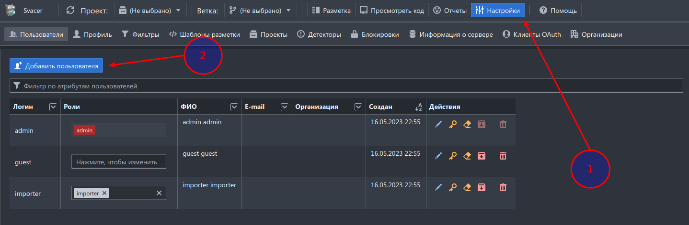
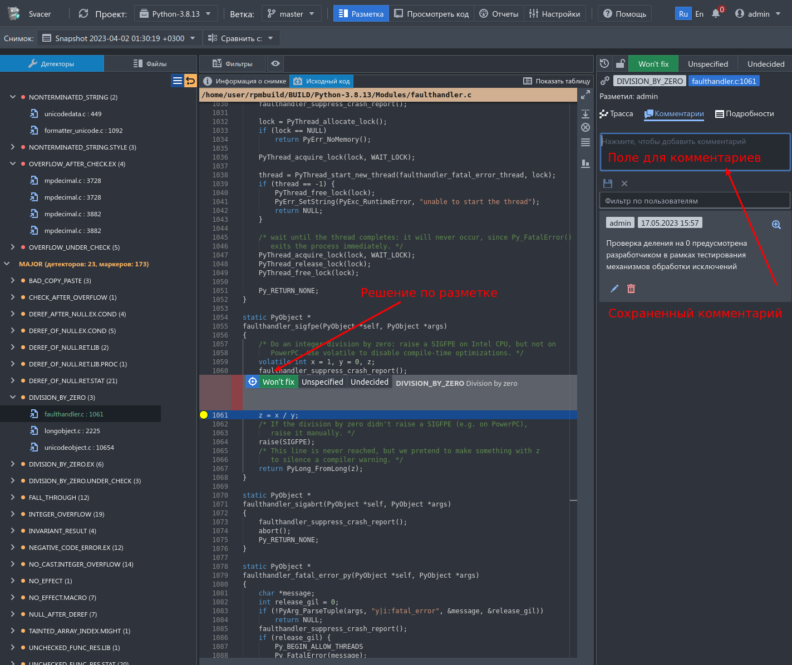
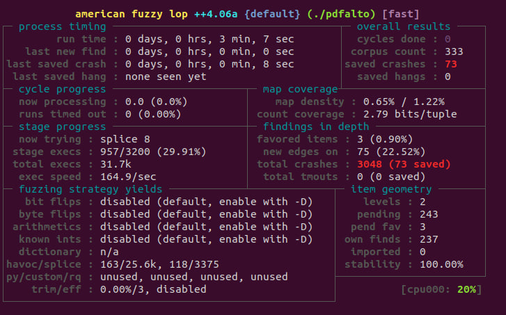

# prz6

Статический анализ кода и фаззинг-тестирование

---

## Задание 1. Статический анализ кода

### Исходные данные

Подготовлен и развернут [сервер](http://secdev.tech:10808) анализа инструмента статического анализа [Svace](https://nextcloud.ispras.ru/index.php/s/izRdcRdZDaEQxFn?path=%2FSvace) (здесь также есть руководство по инструменту)

Краткое описание технологии представлено на сайте [ИСП РАН им. В.П. Иванникова](https://www.ispras.ru/technologies/svace/)

Учетная запись для входа на сервер `admin:bbmomagisters`

Для установки можно использовать [репозиторий](https://repo.ispras.ru/)

### Задача

1. Создать себе учетную запись на сервере анализа с логином по форме `первая_буква_имени.фамилия.группа`.



2. Аутентифицироваться на сервере анализа под своей учетной записью и произвести разметку 10 дефектов уровня критичности `CRITICAL` и `MAJOR`.

> Делать разметку под учетной записью  `admin` не нужно, задание засчитано не будет.

### Отчет

Отчет будет сохранен на сервере анализа, проверка будет производиться на сервере.

Разметить необходимо 20 дефектов различного типа и уровня критичности в одном из проектов.
Каждый размеченный дефект следует сопровождать комментариями, обосновывающими Ваш выбор.




---
## Задание 2. Фаззинг-тестирование приложения

### Задача

1. Необходимо подготовить виртуальную машину с ОС Linux (рекомендуется [Ubuntu](https://www.linuxvmimages.com/images/ubuntu-2204/) или [Debian](https://www.linuxvmimages.com/images/debian-11/) ).

2. Запустить ВМ и установить в нее [Docker](https://www.digitalocean.com/community/tutorials/how-to-install-and-use-docker-on-ubuntu-22-04).

3. Выполнить команду `docker pull aflplusplus/aflplusplus` и внутри [контейнера](https://github.com/AFLplusplus/AFLplusplus/tree/stable#building-and-installing-afl).

4. Выбрать фаззинг-цель для тестирования (простое приложение на `C`) и запустить фаззинг-тестирование исследуемой программы.

5. Подготовить отчет со скриншотами и командами, выполненными внутри контейнера.

### Вспомогательные материалы

1. Курс по [фаззингу](https://github.com/mykter/afl-training)

2. Обучающее видео по [фаззингу](https://www.youtube.com/watch?v=6YLz9IGAGLw)

### Отчет

Отчет следует предствить в формате [Markdown](https://www.markdownguide.org/basic-syntax/) в соответствующей ветке проекта и сделать `merge request` на [gitlab](https://git.secdev.space/mirea-bbmo/prz6)

### Пример отчета 

**pdfalto** is a command line executable for parsing PDF files and producing structured XML representations of the PDF content in ALTO format.

**Исходный код:**

https://github.com/kermitt2/pdfalto

https://github.com/kermitt2/xpdf-4.03


**Сборка проекта:**

```bash
git clone https://github.com/kermitt2/pdfalto.git
cd pdfalto

# get xpdf module
git submodule update --init --recursive

# git clone on error
git clone https://github.com/kermitt2/xpdf-4.03

#install dependencies
./install_deps.sh

cmake .

make -j20
```

**Подготовка корпуса входных данных:**

```bash
git clone https://github.com/openpreserve/format-corpus.git
```

**Сборка с санитайзерами:**

```bash
cd pdfalto

make clean

cmake . -D CMAKE_C_COMPILER=afl-cc -D CMAKE_CXX_COMPILER=afl-c++

AFL_USE_ASAN=1 AFL_USE_UBSAN=1 make -j20
```

Test with sanitizers:

```bash
for F in /src/format-corpus/pdf-handbuilt-test-corpus/*; do ./pdfalto -f 1 -l 1 -noImage $F ; done
```

Patch to fix ASAN heap-overflow in /src/pdfalto.cc:190

```patch
diff --git a/src/pdfalto.cc b/src/pdfalto.cc
index 0a22164..783b1d6 100644
--- a/src/pdfalto.cc
+++ b/src/pdfalto.cc
@@ -187,7 +187,7 @@ int main(int argc, char *argv[]) {

     char *dirname;
     dirname = (char*)malloc(dirname_length + 1);
-    strncat(dirname, thePath, dirname_length); 
+    strncpy(dirname, thePath, dirname_length); 
     dirname[dirname_length] = '\0';

     // set the config file path as alongside the executable
@@ -473,4 +473,4 @@ void removeAlreadyExistingData(GString *dir) {
         if (file) delete file;
         closedir(rep);
     }
-}
\ No newline at end of file
+}
```

**Сборка для анализа покрытия кода:**

```bash
cd pdfalto

make clean

cmake . -DCMAKE_C_COMPILER=cc -DCMAKE_CXX_COMPILER=g++ -DCMAKE_C_FLAGS="-g -O2 --coverage" -DCMAKE_CXX_FLAGS="-g -O2 --coverage" -DCMAKE_EXE_LINKER_FLAGS="-lgcov" 

make -j20
```

**Тестирование покрытия:**

```bash
for F in /src/format-corpus/pdf-handbuilt-test-corpus/*; do ./pdfalto -f 1 -l 1 -noImage $F ; done

lcov -t "pdfalto" -o pdfalto.info -c -d .

genhtml -o report pdfalto.info
```

**Результаты:**

```
Overall coverage rate:
  lines......: 12.2% (6033 of 49594 lines)
  functions..: 12.6% (444 of 3523 functions)
```

**Фаззинг-тестирование:**

```bash
cd pdfalto

make clean

cmake . -D CMAKE_C_COMPILER=afl-cc -D CMAKE_CXX_COMPILER=afl-c++

AFL_USE_ASAN=1 AFL_USE_UBSAN=1 make -j20

afl-fuzz -i /src/format-corpus/pdf-handbuilt-test-corpus -o out -t 1000 ./pdfalto -f 1 -l 1 -noImage @@
```



